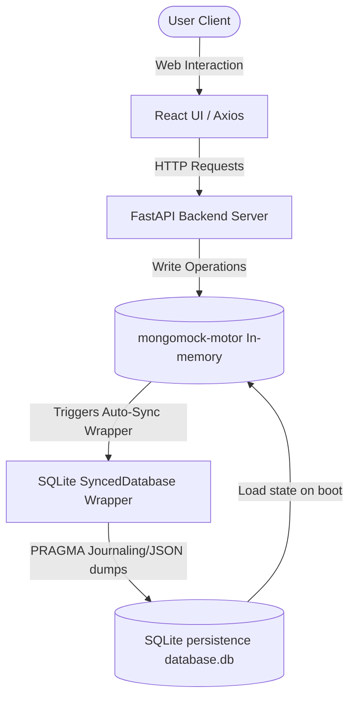
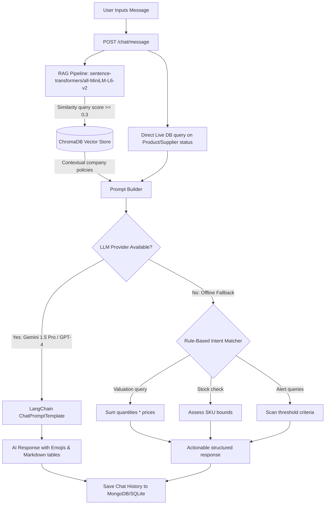

# 🤖 AI Inventory Management Agent — Nexus AI

A state-of-the-art, full-stack enterprise inventory system. Powered by four specialized LangChain AI Agents, local semantic document search (RAG) using ChromaDB, real-time telemetry, and persistent MongoDB/SQLite mock layers.

---

## 🗺️ System & Data Architecture Flowcharts

### 1. Data Ingestion & Storage Architecture
This flow illustrates the persistent hybrid storage model where an in-memory MongoDB client updates and periodically syncs state to a SQLite database, ensuring local asset telemetry survives server restarts.



### 2. Multi-Agent AI Workflow Chat & Queries
The diagram shows how incoming queries are handled dynamically. Depending on user intent and system configuration, requests route through the RAG vector search, Gemini Chat, or direct rule-based fallbacks.



---

## 🚀 Built-in AI Agents & Prompts

Nexus AI incorporates four distinct autonomous agents located in `backend/app/ai/agents/`. Each agent is constructed using tailored prompts for high-context data parsing.

### 🔍 1. Analysis Agent
- **Prompt**: `docs/prompts/analysis_agent.txt`
- **Mandate**: Scan the unified live inventory stream and historical logs. Identify dead stock, find imminent depletion risk vectors, calculate severity metrics, and suggest urgent reorders.

### 💬 2. Assistant Agent
- **Prompt**: `docs/prompts/assistant_agent.txt`
- **Mandate**: Serve as the conversational primary contact. Injects live telemetry and vector-matched business protocols directly into the prompt context to answer specific, complex business questions without hallucinations.

### 💡 3. Recommendation Agent
- **Prompt**: `docs/prompts/recommendation_agent.txt`
- **Mandate**: Act as a supply chain strategist. Identify replenishment needs, optimize bulk procurement items, suggest order quantities, and forecast procurement costs.

### 📊 4. Report Agent
- **Prompt**: `docs/prompts/report_agent.txt`
- **Mandate**: Formulate board-ready executive summaries. Dynamically compute gross margins, identify over-allocated categories, and detail strategic restock logs.

---

## 🛠️ Tech Stack & Key Layers

- **Frontend**: React 19, TypeScript, Vite, Tailwind CSS, Lucide icons, Recharts
- **API Backend**: FastAPI, Uvicorn, Python 3.10+
- **Persistence**: `mongomock-motor` for asynchronous MongoDB API compatibility, paired with a custom SQLite sync callback layer
- **Vector search**: ChromaDB, HuggingFace embeddings (`all-MiniLM-L6-v2`)
- **JSON Validation**: `JsonOutputParser` from `langchain_core`

---

## 🧬 End-to-End Operational Walkthrough

Here is a walkthrough of how a user operates Nexus AI from session initialization to reporting:

### 1. Unified Authentication
- The user logs in via the dashboard. The client stores a JWT `access_token` and `refresh_token` in local storage.
- Axios request interceptors automatically inject `Authorization: Bearer <token>` globally. If a request returns `401 Unauthorized`, response interceptors attempt token rotation dynamically via `POST /auth/refresh`.

### 2. Live Inventory Telemetry & Management (Asset Ledger)
- The main table feeds from `GET /products`.
- Users can restock or make items sold. Clicking restock inputs coordinates an instant `POST /products/{id}/stock?delta=N&change_type=restock` query to the FastAPI router, updating the database.
- State is committed to the SQLite file `database.db` immediately.

### 3. AI Predictive Analytics & Insights
- On load, the dashboard queries `GET /agents/alerts`.
- The **Analysis Agent** runs either its Gemini parser or local boundary scanner list to check every product. It returns warnings for high/critical risks.

### 4. Interactive Q&A (Nexus AI Chat)
- Users post messages like *"Which of our laptops is running low?"*.
- The message is vectorized and matched against any manuals imported into the RAG pipeline.
- The **Assistant Agent** combines the retrieved manuals, live product states, and user message, delivering structured markdown tabular reports.

### 5. Document RAG Ingestion
- In the reports or settings page, users upload policy PDFs.
- The `POST /upload/document` API reads files via `PyPDF`, splits text into 500-token units, matches it with embeddings, and pushes it to local ChromaDB space.

---

## ⚙️ Running Locally

### Installation & Initialization

1. **Clone & Setup Environment**
   Rename `.env.example` to `.env` in the root and add your details:
   ```env
   MONGO_URI=mongodb+srv://...
   MONGO_DB_NAME=inventory_db
   SECRET_KEY=yoursecretkeyhere
   GEMINI_API_KEY=your-gemini-key
   LLM_PROVIDER=gemini
   ```

2. **Backend Server Startup**
   ```bash
   cd backend
   pip install -r requirements.txt
   python -m uvicorn app.main:app --reload --host 0.0.0.0 --port 8000
   ```

3. **Frontend Client Startup**
   ```bash
   cd frontend
   npm install
   npx vite --port 5173 --host
   ```

4. **Verify Application**
   - Access web UI at: **`http://localhost:5173`**
   - Login template: `admin@nexus.ai` / `admin123`