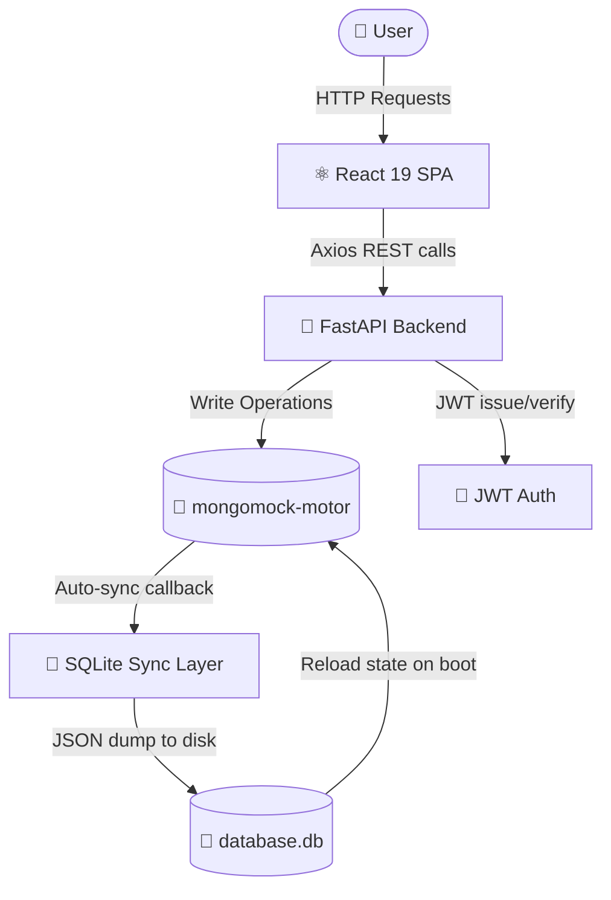
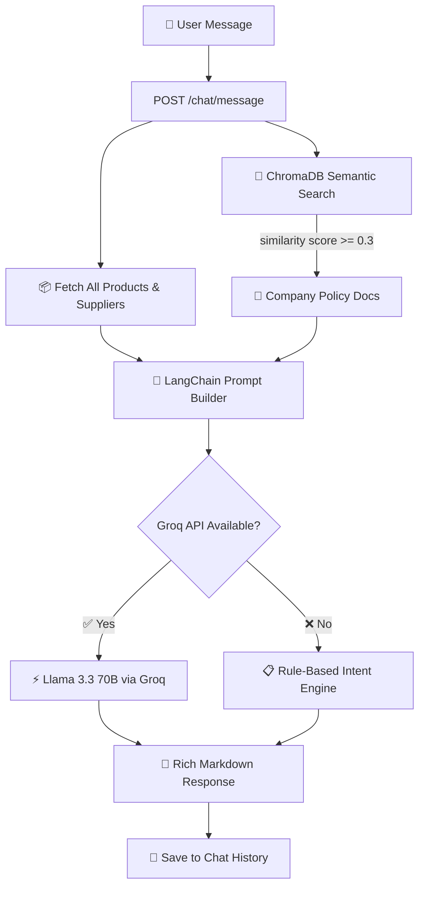
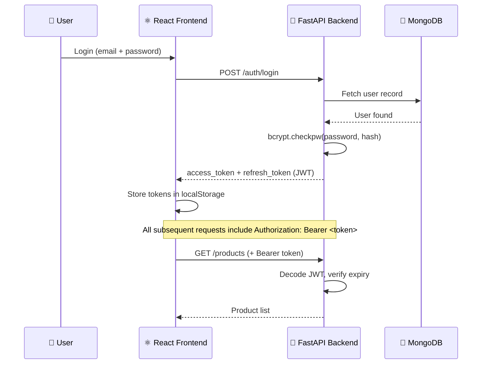

# 🤖 Nexus AI — Inventory Management Agent


> An enterprise-grade, AI-powered inventory management system featuring four specialized LangChain agents, RAG-based document intelligence, and a stunning real-time dashboard — all powered by **Llama 3.3 70B via Groq**.

---

## 🌐 Live Demo

> **🚀 [https://inventary-agent.onrender.com/chat](https://inventary-agent.onrender.com/chat)**

| Credential | Value |
|---|---|
| 📧 Email | `admin@nexus.ai` |
| 🔑 Password | `admin123` |

---

## 🧠 What is Nexus AI?

Nexus AI is a **full-stack AI inventory intelligence platform** built for businesses that want more than just a spreadsheet. Instead of manually tracking stock levels, the system uses four autonomous AI agents to:

- 🔍 **Detect low stock & dead stock** automatically
- 💬 **Answer natural language questions** about your inventory
- 📦 **Recommend what to reorder & from which supplier**
- 📊 **Generate executive board-level reports** on demand
- 📄 **Search company policy documents** via semantic RAG search

---

## 🛠️ Tech Stack

| Tier | Technology | Role |
|---|---|---|
| **Frontend** | React 19 + Vite 6 | SPA framework with HMR development server |
| **Styling** | Vanilla CSS (custom design system) | Premium dark UI with glassmorphism & micro-animations |
| **Backend** | FastAPI 0.111 + Uvicorn | Async-capable ASGI REST API server |
| **Auth** | python-jose + bcrypt | JWT token issuance, refresh rotation & password hashing |
| **Database** | mongomock-motor + SQLite | In-memory MongoDB API with SQLite persistence layer |
| **Vector DB** | ChromaDB | Embedding-based document retrieval for company policies |
| **Embeddings** | Google GenAI (text-embedding-004) | Lightweight cloud-based semantic document embeddings |
| **LLM** | Llama 3.3 70B (Groq) | Primary intelligence engine for all 4 AI agents |
| **AI Framework** | LangChain + LangChain-Groq | Agent orchestration, prompt chaining & JSON parsing |
| **Deployment** | Render (Docker, single-service) | Multi-stage Docker build — frontend + backend in one image |

---

## 🤖 Ask the AI Agent — Sample Questions

Paste these directly into the **Nexus AI Chat** at `/chat`:

### 📦 Inventory Queries
```
What products are currently out of stock?
Show me all items below their reorder threshold
What is the total value of our entire inventory?
Which product has the highest unit price?
How many products are in the Electronics category?
Give me a complete status report of all stock levels
```

### 🔍 Specific Product Lookups
```
What is the current stock level for MacBook Pro 14?
Is the Wireless Mouse available?
How many units of the Ergonomic Chair do we have?
What is the reorder threshold for Laptop Stand?
```

### 📊 Analytics & Insights
```
Which category has the most inventory value?
What is the gross margin potential of our current stock?
Which products have not moved in the last 30 days?
Show me the top 5 most expensive products we carry
What is our total cost basis across all stock?
```

### 💡 Supply Chain & Recommendations
```
Which suppliers should I contact urgently for restocking?
Can we consolidate any purchase orders to save costs?
What should be our reorder priority this week?
Which items represent capital trapped in dead stock?
```

### 📄 Company Policy (RAG)
```
What is our return policy for electronics?
What are the reorder approval procedures?
What compliance regulations apply to our warehouse?
Summarize our supplier SLA agreements
```

---

## 🗺️ System Architecture

### Data Flow & Persistence Layer



### AI Multi-Agent & RAG Pipeline



### Authentication Flow



---

## 🔁 End-to-End User Journey

### Step 1 — Login & Authentication
The user logs in via the premium dark dashboard. JWT tokens are stored in `localStorage`. Axios interceptors automatically attach `Authorization: Bearer <token>` to every API call and silently refresh expired tokens.

### Step 2 — Live Dashboard Telemetry
The dashboard loads real-time KPIs: total inventory value, stock health distribution, low-stock alerts, and category breakdowns. Data is fetched from the live SQLite-backed mock MongoDB layer.

### Step 3 — Inventory Management (CRUD)
Users can add products, edit details, and update stock levels. Each stock change is logged with a `change_type` (`sale`, `restock`, `adjustment`) and the resulting quantity is saved to the persistent `database.db`.

### Step 4 — AI Analysis (Automatic Alerts)
On page load, the **Analysis Agent** scans all inventory and flags:
- ⛔ `critical_out_of_stock` — quantity is 0
- ⚠️ `low_stock` — quantity ≤ reorder threshold
- 💀 `dead_stock` — no movement in 30+ days
- 📉 `predicted_shortage` — fast depletion velocity

### Step 5 — AI Chat (Natural Language Q&A)
Users ask questions in plain English. The **Assistant Agent** injects live inventory data and retrieves matching policy documents from ChromaDB to power its response. It falls back to deterministic rule-based logic if Groq is unavailable.

### Step 6 — Recommendations
The **Recommendation Agent** acts as a supply chain strategist — prioritizing urgent reorders, identifying consolidation opportunities with shared suppliers, and calculating estimated order costs.

### Step 7 — Executive Reports
The **Report Agent** generates a full business intelligence report with: total inventory value, gross margin potential, stock health breakdown, category performance, and a 3–5 point action plan.

### Step 8 — Document RAG Ingestion
Users can upload company policy PDFs or TXT files via the Upload interface. The text is chunked, embedded via Google GenAI (`text-embedding-004`), and stored in ChromaDB — ready to be retrieved and cited in any future AI chat query.

---

## 📁 Project Structure

```
Inventary-Agent/
├── Dockerfile                    # Multi-stage: build React → serve from FastAPI
├── render.yaml                   # Render Blueprint (one-click deploy)
├── docker-compose.yml            # Local full-stack Docker setup
│
├── backend/
│   ├── app/
│   │   ├── main.py               # FastAPI entry point + static file serving
│   │   ├── config.py             # pydantic-settings env loader
│   │   ├── auth/
│   │   │   ├── dependencies.py   # JWT token verification middleware
│   │   │   └── password.py       # bcrypt hash/verify helpers
│   │   ├── db/
│   │   │   ├── mongo.py          # mongomock + SQLite sync persistence
│   │   │   └── chroma.py         # ChromaDB client factory
│   │   ├── ai/
│   │   │   ├── agents/
│   │   │   │   ├── analysis_agent.py      # 🔍 Stock health scanner
│   │   │   │   ├── assistant_agent.py     # 💬 Conversational Q&A
│   │   │   │   ├── recommendation_agent.py # 💡 Supply chain advisor
│   │   │   │   └── report_agent.py        # 📊 Executive report generator
│   │   │   ├── llm_provider.py    # Provider factory: Groq / Gemini / OpenAI
│   │   │   └── rag_pipeline.py    # ChromaDB RAG: ingest + semantic query
│   │   ├── models/               # Pydantic data models
│   │   ├── routes/               # FastAPI routers for all endpoints
│   │   └── services/             # Business logic layer
│   └── requirements.txt
│
├── frontend/
│   ├── src/
│   │   ├── api/apiClient.ts      # Axios instance + JWT interceptors
│   │   ├── pages/
│   │   │   ├── Login.tsx         # Authentication page
│   │   │   ├── Dashboard.tsx     # KPI overview + charts
│   │   │   ├── Products.tsx      # Inventory CRUD + stock management
│   │   │   ├── Chat.tsx          # AI chat interface
│   │   │   └── Reports.tsx       # Report generation UI
│   │   └── components/
│   └── vite.config.ts
│
└── docs/
    ├── PROMPTS.md                # Complete AI agent prompt reference
    └── prompts/
        ├── analysis_agent.txt
        ├── assistant_agent.txt
        ├── recommendation_agent.txt
        └── report_agent.txt
```

---

## ⚙️ Local Setup

### Prerequisites
- Python 3.10+
- Node.js 20+
- A [Groq API Key](https://console.groq.com/) (free tier)

### 1. Clone & Configure
```bash
git clone https://github.com/Praveenofficial12/Inventary-Agent.git
cd Inventary-Agent
```

Create `backend/.env`:
```env
MONGO_URI=mongodb://localhost:27017
MONGO_DB_NAME=inventory_db
SECRET_KEY=your_secret_key_here
LLM_PROVIDER=groq
GROQ_API_KEY=your_groq_api_key_here
```

### 2. Run Backend
```bash
cd backend
pip install -r requirements.txt
python -m uvicorn app.main:app --reload --host 0.0.0.0 --port 8000
```

### 3. Run Frontend
```bash
cd frontend
npm install
npx vite --port 5173 --host
```

### 4. Access
| Service | URL |
|---|---|
| 🖥️ Frontend UI | http://localhost:5173 |
| 🔌 Backend API | http://localhost:8000 |
| 📚 Swagger Docs | http://localhost:8000/docs |

---

## 🌐 Deploy to Render

This repo includes a `render.yaml` Blueprint for one-click deployment:

1. Go to [Render Dashboard](https://dashboard.render.com/) → **New +** → **Blueprint**
2. Connect `https://github.com/Praveenofficial12/Inventary-Agent`
3. Set `GROQ_API_KEY` in the environment variables panel
4. Click **Apply** — Render builds the Docker image and deploys!

> ✅ The multi-stage `Dockerfile` compiles the React frontend and bakes it into the FastAPI image — a single service hosts everything.

---

## 🔐 API Endpoints Reference

| Method | Endpoint | Description |
|---|---|---|
| `POST` | `/auth/login` | Authenticate and get JWT tokens |
| `POST` | `/auth/register` | Register a new user |
| `GET` | `/products/` | List all inventory products |
| `POST` | `/products/` | Add a new product |
| `POST` | `/products/{id}/stock` | Update stock level |
| `GET` | `/categories/` | List all categories |
| `GET` | `/suppliers/` | List all suppliers |
| `POST` | `/chat/message` | Send message to AI Assistant Agent |
| `GET` | `/agents/alerts` | Trigger Analysis Agent (stock alerts) |
| `GET` | `/agents/recommendations` | Trigger Recommendation Agent |
| `GET` | `/reports/generate` | Generate executive inventory report |
| `POST` | `/upload/document` | Upload policy PDF for RAG ingestion |

---

## 👨‍💻 Author

**Praveen** — Built for placement project submission.

[](https://github.com/Praveenofficial12)
[](https://inventary-agent.onrender.com/chat)